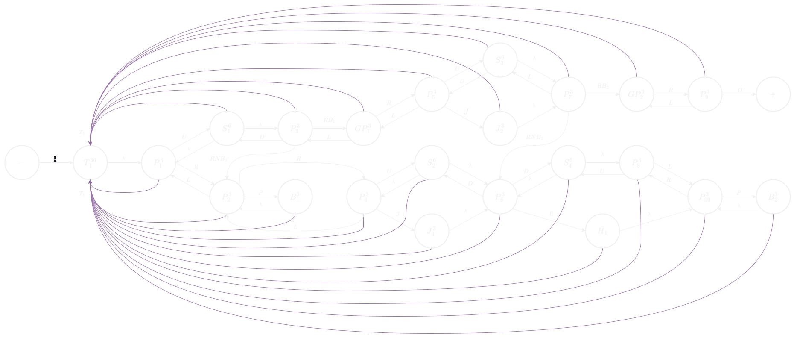

# Platformata
## Game Design with Automata Theory
### Ahmed Shuaib

---

# Introduction

- Automata is widely used to analyze systems, design compilers, and programming languages.

- Modern development tools are developed to optimize the development experience.

- Lets explore the use of methods and tools of automata to achieve.
  - Optimize the development experience for 2D game developers.
  - Build an framework that can be modified and built upon.

---

# Literature Review

[1] In a paper from 2022 A procedural-level generation has been demonstrated using cellular automata.

- A genetic algorithm is used to evolve the cellular automata rules applied to generate game levels.

- A Procedural content generator designed using this method is meant to be used during the game development process rather than at runtime.

---

[2] In a paper from 2016 students designed an infinite runner game using mealy machines.

- The game consisted of several states such as: running, jumping, and flying.

- Games designed using automata are less prone to bugs and the development process is simplified.

---

[3] Conway's Game of Life

- Developed by John Conway.

- A "zero-player" game utilizing cellular automata.

- Essentially a square grid containing cells that evolve in each time step based on three rules: birth, death, and survival.
  - Dead cell will become alive -> 3 neighbouring cells are alive.
  - Cell will die -> four or more/one or fewer neighbouring cells are alive. 
  - Cell survives -> two or three neighbouring cells are alive. 

---

# Game Description

A game design for a 2D Platformer.

- Reach the end most efficiently with:
  - As few attempts as possible.
  - As fast as possible.
  
- Each state you encounter may take time, the amount of time some state takes generally varies based on the type of state.

- When the player runs out of time, they transition back to thart for another attempt.

- As the levels go on complexity increases.
  - Try various paths
  - Implement strategies

---

# Game Design

- Scalability and modularity of the game have been considered.
- If one intends to follow the game design that follows:
  - Relatively simple to implement and build on the logic of this game using modren development tools.
  - Ideas: Designing game mechanics that rely on a time-distance/time-state relationship, adding additional states, or utilizing procedural generation.
  
 - The possibilities are endless :)

---
	
# Input Alphabet

$\sum_{\text{Move }} \; = \{\text{ U, D, L, R }\}\quad$ Defines the movement of the player.

$\sum_{\text{Action}} = \{\text{ P, J, O }\}\qquad\;\;$ Defines the actions the player can take.

$\sum_{\text{Game}} \; = \{  \; \text{T}_{\text{n}}, \; \text{TA}_{\text{n}}, \; \text{A}_{\text{n}},  \; \text{B}_{\text{n}},  \; \text{NB}_{\text{n}}, \; \text{D}_{\text{n}},  \; \text{ND}_{\text{n}}  \; \}$

$\uparrow$ Defines some data for the game level. Counters (Integers) and Status (Booleans). This data is reset at the start of each level.

---

# States of the game

#### Time State ($\text{T}_{\text{n}}^{\text{t}}$)
Effects: $\text{T}_{\text{n}} = \text{t} \quad \texttt{++}\text{TA}_{\text{n}}$

#### Platform State ($\text{P}_{\text{n}}^{\text{t}}$)
Effect: $\text{T}_{\text{n}} \texttt{-= } t \quad \texttt{++}\text{A}_{\text{n}}$

#### Stair State ($\text{S}_{\text{n}}^{\text{t}}$)
Effects: $\text{T}_{\text{n}} \texttt{-= } t \quad \texttt{++}\text{A}_{\text{n}}$

#### Button State ($\text{B}_{\text{n}}^{\text{t}}$)
Effects: $\text{T}_{\text{n}} \texttt{-= } t \quad \text{B}_{\text{n}} = 1 \quad \text{NB}_{\text{n}} = 0 \quad \texttt{++}\text{A}_{\text{n}}$

---

#### Jump State ($\text{J}_{\text{n}}^{\text{t}}$)
Effects: $\text{T}_{\text{n}} \texttt{-= } t \quad \texttt{++}\text{A}_{\text{n}}$

#### Hole state ($\text{H}_{\text{n}}$)
Effect: $\texttt{++}\text{A}_{\text{n}}$

#### Ghost Platform State ($\text{GP}_{\text{n}}^{\text{t}}$)
Effects: $\text{T}_{\text{n}} \texttt{-= } t \quad \texttt{++}\text{A}_{\text{n}}$

#### Ghost Wall State ($\text{GW}_{\text{n}}^{\text{t}}$)
Effects: $\text{T}_{\text{n}} \texttt{-= } t \quad \texttt{++}\text{A}_{\text{n}}$

---

#### Platform Wall and Cube States ($\text{PW}_{\text{n}}^{\text{h}^{\text{d}}} \quad \text{C}_{\text{n}}^{\text{h}^{\text{d}}}$)
Effects: 

$\text{T}_{\text{n}} \; \texttt{-=} \; (\text{h} - (\text{d} \cdot (\texttt{++}\text{A}_{\text{n}})))$

$\text{D}_{\text{n}} = (\text{h} - (\text{d} \cdot \text{A}_{\text{n}})) \leq 0$

$\text{ND}_{\text{n}} =  (\text{h} - (\text{d} \cdot \text{A}_{\text{n}})) > 0$

---

##  Level 1

- Time: 36 seconds.
- Introduces: Platforms, stairs, jump pads, buttons, ghost platforms.
- Attempts (Estimate): 2

---

##  Level 2

- Time: 120 seconds.
- Features: Platforms, stairs, jump pads, buttons, ghost platforms.
- Introduces: Ghost walls and cubes.
- Attempts (Estimate): 2

---

## Level 3

- Time: 90 seconds
- Features: Platforms, stairs, jump pads, buttons, ghost platforms, ghost walls, platforms.
- Introduces: Platform walls.
- Attempts (Estimate): 2-3

---

---

## Level 4

- Time: 90 seconds.
- Features: Platforms, stairs, jump pads, buttons,ghost walls, platforms, platform walls.
- Attempts (Estimate): 2-3

---

---

# Conclusion
- Incorporating automata into game design offers:
  - A pleasant gameplay experience.
  - Streamlines the design and development process.
- Using methods and tools of automata is a worthwhile approach to achieve an optimized development experience for game developers.

---

# References

- [1] Adel Sabanovic and Amir Khodabakhshi, Evolved cellular automata for 2D video game level generation, 2022.
- [2] Abid Jamil, Engr. AsadUllah and Mohsin Rehman, An Infinite Runner Game Design using Automata Theory, 2016.
- [3] Kuldeep Vayadande, Ritesh Pokarne, Tanmay Patil, Mahalakshmi Phaldesai, Prachi Kumar, and Tanushri Bhuruk, Simulation of Conway's Game of Life using cellular automata, 2022.

---

##  This project would be have been difficult without the help of the following tools:

- Drawio

- $\LaTeX$ and pdfTeX

- Marp

All these tools are open source (Support open source software)

---

# Thank you :)
